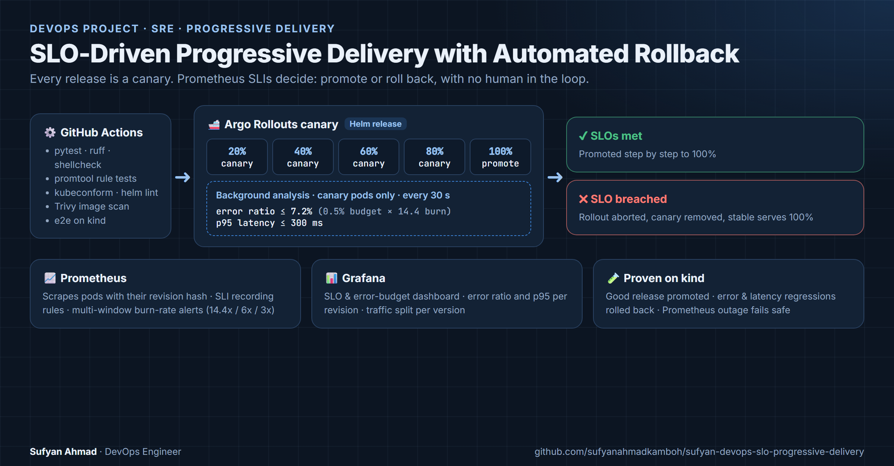

# SLO-Driven Progressive Delivery with Automated Rollback

Every release of the service goes out as a **canary**. While traffic shifts 20% → 40% → 60% → 80% → 100%, an automated analysis checks the canary's **service-level indicators in Prometheus** (error ratio and p95 latency) against the service's **SLOs**.
- A release that would burn the error budget too fast is **aborted and rolled back automatically**, and the stable version keeps serving users.
- A healthy release is promoted with no human in the loop.




> 📚 **New to DevOps? Start with the [study guide](study/README.md)** (also available as a single **[PDF](study/study-guide.pdf)**). It teaches every tool in this project from zero: what it is, why it's used here, how it's wired in, and hands-on labs.
> It covers Docker, Kubernetes, kind, Helm, SLOs, Prometheus, Argo Rollouts, Grafana, GitHub Actions and the security tools, plus 8 guided labs and 25 interview questions.

> 🎬 **Prefer to watch? [Watch the 15-minute video on YouTube](https://youtu.be/U_sdKzHRKGE)** ([how it is made](video/README.md)). It explains the project in plain words, then shows a real run: a healthy release promoted, an error regression and a latency regression rolled back by themselves, and a monitoring outage that fails safe. Every output and dashboard on screen comes from that run.

---

## 1. Problem statement

**Classic CI/CD answers one question:** *did the deployment succeed?* It doesn't answer the one users care about: *is the new version actually healthy?*
- **Rolling updates:** a regression reaches 100% of traffic within minutes.
- **Detection:** the bad release is usually discovered through a page or a customer complaint.
- **Recovery:** rollback is a manual decision, made under pressure.

## 2. Pain point

| Without this | With this |
|---|---|
| Bad releases reach all users before anyone notices | A bad release reaches about 20% of traffic, for about a minute |
| "Is it bad enough to roll back?" is a judgment call during an incident | The decision is a pre-agreed, version-controlled SLO threshold |
| Alerting and deployment use different definitions of "healthy" | The canary gate and the on-call page use the **same** burn-rate threshold |
| Rollback depends on someone being awake | Abort and rollback are automatic and fail safe, even when monitoring is down |

## 3. Objectives

1. Define availability and latency **SLOs** with **SLIs** recorded in Prometheus.
2. Alert on **error-budget burn rate** (multi-window, multi-burn-rate, per the Google SRE Workbook), with the alert logic unit-tested.
3. Gate every release on the **canary's own SLIs**, separate from the stable pods.
4. **Prove** the behaviour end to end, both locally and in CI:
   - a good release is promoted
   - error and latency regressions are rolled back
   - a monitoring outage fails safe

## 4. Architecture

```
 GitHub Actions ── test · lint · promtool · kubeconform · Trivy · e2e on kind
        │
        ▼ helm upgrade (new image tag)
 ┌──────────────────────── kind / Kubernetes ─────────────────────────┐
 │  Argo Rollouts: canary 20% → 40% → 60% → 80% → 100%                 │
 │        │  background AnalysisRun (canary pods only, every 30 s)     │
 │        │    error ratio ≤ 0.072  (0.5% budget × 14.4 burn rate)     │
 │        │    p95 latency ≤ 300 ms                                    │
 │        ▼                                                            │
 │  orders-api pods (stable + canary) ◄── load generator (20 req/s)    │
 │        │ /metrics, labelled by revision hash                        │
 │        ▼                                                            │
 │  Prometheus: SLI recording rules · burn-rate alerts · analysis      │
 │        ▼                                                            │
 │  Grafana: SLO / error budget / canary-vs-stable dashboard           │
 └─────────────────────────────────────────────────────────────────────┘
   pass → promote to 100%        fail → abort: canary scaled to 0, stable 100%
```

Full design, decision log and trade-offs: **[docs/architecture.md](docs/architecture.md)**

## 5. Technologies

| Technology | Used for |
|---|---|
| Kubernetes (kind v0.33, 3 nodes) | Runtime: local, reproducible, identical in CI |
| Argo Rollouts v1.10 | Canary strategy, background analysis, automatic abort |
| Prometheus v3.15 | SLI recording rules, burn-rate alerts, analysis queries |
| Grafana v13 | SLO and error-budget dashboard, provisioned as code |
| Helm 4 | Packaging; one chart for real and accelerated test timings |
| Python 3.13 + prometheus-client | Instrumented service and load generator |
| Docker | Multi-stage, non-root image |
| GitHub Actions | CI pipeline including a full end-to-end run on kind |
| promtool, kubeconform, shellcheck, ruff, pytest, Trivy | Validation and security scanning |

## 6. Repository structure

```
app/                    orders-api service, load generator, unit tests, Dockerfile
charts/orders-api/      Rollout, AnalysisTemplate, Service, NetworkPolicy, load generator
slo/rules/              SLI recording rules and burn-rate alerts (single source of truth)
slo/tests/              promtool unit tests for the alert logic
platform/monitoring/    Prometheus (pod discovery, RBAC) and Grafana (provisioning)
grafana/dashboards/     SLO dashboard JSON
scripts/                up, release, e2e, chaos and security tests, down
ci/fast-values.yaml     accelerated timings for automated tests
kind/cluster.yaml       local cluster definition
docs/                   architecture, runbook, troubleshooting, test results
study/                  beginner study guide: every tool explained, labs, glossary, interview questions
video/                  the explainer video: recorded run, script and build pipeline
```

## 7. Prerequisites

- Docker (running), `kind` ≥ 0.33, `kubectl`, `helm` ≥ 3.14 (tested with Helm 4.2), `make`, bash. On Windows use Git Bash or WSL.
- For the static checks: Python 3.12+, `shellcheck`, `kubeconform`.
- About 4 GB of free RAM for the 3-node kind cluster.

## 8. Installation and deployment

```bash
git clone https://github.com/sufyanahmadkamboh/sufyan-devops-slo-progressive-delivery.git
cd sufyan-devops-slo-progressive-delivery
make up            # kind cluster + Argo Rollouts + Prometheus + Grafana + orders-api 1.0.0 (~3 min)
```

**Release versions through the SLO gate:**
```bash
scripts/release.sh 1.1.0                    # healthy: promoted to 100%
scripts/release.sh 1.2.0 --inject-errors    # 25% errors: aborted, 1.1.0 keeps serving
scripts/release.sh 1.3.0 --inject-latency   # +600 ms: aborted on the latency SLO
kubectl -n delivery get rollout orders-api -w
```

**Open the dashboards:**
```bash
kubectl -n monitoring port-forward svc/grafana 3000:3000      # http://localhost:3000 (read-only anonymous)
kubectl -n monitoring port-forward svc/prometheus 9090:9090   # http://localhost:9090
```

## 9. Configuration

| Value (`charts/orders-api/values.yaml`) | Default | Meaning |
|---|---|---|
| `slo.availabilityTarget` | `0.995` | 99.5% non-5xx, so the error budget is 0.5% |
| `slo.latencyTargetSeconds` | `0.3` | p95 must stay under 300 ms |
| `analysis.maxBurnRate` | `14.4` | Fastest acceptable budget burn for a canary (same as the fast-burn page) |
| `analysis.interval` / `initialDelay` | `30s` / `30s` | Measurement cadence |
| `analysis.failureLimit` | `1` | Abort on the 2nd failed measurement |
| `analysis.consecutiveErrorLimit` | `4` | Abort if Prometheus is unreachable 5 times in a row |
| `canary.weights` / `pauseDuration` | `[20,40,60,80]` / `60s` | Rollout steps |
| `fault.errorRate` / `fault.latencyMs` | `0` / `0` | Fault injection for tests only |

The canary error-ratio threshold is derived as `(1 − availabilityTarget) × maxBurnRate`, which gives **0.072** by default.

## 10. Testing

| Level | Command | What it proves |
|---|---|---|
| Unit | `make test` | Metrics, probes and fault injection behave correctly (11 tests) |
| Static | `make lint` | ruff, shellcheck, helm lint, kubeconform (including Argo Rollouts CRD schemas) |
| SLO logic | `make slo-test` | `promtool test rules`: fast burn pages, slow burn pages, healthy stays silent |
| End to end | `make e2e` | Real releases on kind: one promoted, two rolled back |
| Failure | `make chaos` | Prometheus outage mid-canary: the rollout aborts (fail safe) |
| Security | `make netpol` | NetworkPolicy blocks traffic from other namespaces |

All of the above also run in GitHub Actions on every push. **Measured results:** [docs/test-results.md](docs/test-results.md).

## 11. Monitoring

**Grafana dashboard "orders-api: SLOs & progressive delivery":**
- availability and latency SLIs
- error budget remaining
- burn rate per window (with the 6x and 14.4x thresholds drawn in)
- error ratio and p95 **per revision** (canary vs stable)
- traffic split per version during a rollout

**Alerts:** fast burn (14.4x, 1h/5m, page), slow burn (6x, 6h/30m, page), ticket burn (3x, 1d/2h), latency fast burn. Each alert links to a section of the [runbook](docs/runbook.md).

## 12. Security

- **Pods:**
  - non-root (UID 10001)
  - read-only root filesystem
  - all capabilities dropped
  - seccomp `RuntimeDefault`
  - no service-account token
  - CPU and memory limits
- **NetworkPolicy:** ingress only from the same namespace and from `monitoring`. This is verified by `make netpol`.
- **Image:** multi-stage and non-root, scanned by Trivy in CI. CI fails on fixable HIGH/CRITICAL vulnerabilities.
- **Secrets:** the Grafana admin password is generated at deploy time and never stored in the repository.
- **Prometheus RBAC:** read-only access to pods (`get/list/watch`).

## 13. Troubleshooting

See **[docs/troubleshooting.md](docs/troubleshooting.md)**. It covers the Helm 4 server-side-apply conflict with controller-managed Service selectors, found and fixed while building this project. It also covers analysis "no data" situations, `Error` vs `Failed` analysis runs, and Windows notes.

## 14. Failure scenarios

| Scenario | Expected behaviour | Tested by |
|---|---|---|
| New version returns 25% errors | Canary error ratio exceeds 0.072, so the rollout aborts and stable serves 100% | `e2e.sh` scenario 2 |
| New version is 600 ms slower | Canary p95 exceeds 300 ms, so the rollout aborts | `e2e.sh` scenario 3 |
| Prometheus unavailable during a canary | The analysis can't measure, so after 5 errors it ends in `Error` and the rollout aborts: never promote unverified | `chaos-prometheus-outage.sh` |
| Canary receives no traffic | An empty query result counts as a failed measurement, so the rollout is never promoted on missing data | `successCondition: len(result) > 0` |
| Regression smaller than the gate (for example 4% errors) | It passes the canary but triggers the **slow-burn** page within about 15 min | `promtool` test "sustained moderate errors" |

## 15. Disaster recovery and operations

- **The cluster is disposable:** `make down && make up` rebuilds everything from Git in about 3 minutes. Prometheus data is intentionally ephemeral (lab).
- **Aborted release:** restore by setting the desired version back to stable, or by releasing a fixed version. See the [runbook](docs/runbook.md#release-aborted-by-the-analysis).

## 16. Cleanup

```bash
make down          # deletes the kind cluster
docker image rm $(docker image ls 'orders-api' -q)   # optional: remove built images
```

## 17. Future improvements

- **Gateway API or service-mesh traffic routing,** for exact 1–5% canary weights independent of the replica count.
- **Alertmanager routing,** to Slack or PagerDuty.
- **Argo CD,** so releases are driven by Git commits (GitOps).
- **Long-term metrics storage** (Thanos or Mimir), for a true 30-day SLO window.
- **Signed images** (cosign) and admission-time signature verification.

## 18. Learning resources

The **[study guide](study/README.md)** is a self-contained course built around this repository.

| Chapter | Topic |
|---|---|
| [0](study/00-big-picture.md) | The big picture, without jargon |
| [1](study/01-docker.md) – [4](study/04-helm.md) | Docker, Kubernetes, kind, Helm |
| [5](study/05-sre-slo-basics.md) – [8](study/08-grafana.md) | SLOs and error budgets, Prometheus and PromQL, Argo Rollouts, Grafana |
| [9](study/09-github-actions.md) – [10](study/10-quality-security-tools.md) | GitHub Actions, and the quality and security tools |
| [11](study/11-how-it-fits-together.md) | One request and one release traced through every tool |
| [12](study/12-hands-on-labs.md) | 8 hands-on labs |

Also included: a [glossary](study/glossary.md) and [25 interview questions with answers](study/interview-questions.md).

## 19. Skills demonstrated

**SRE:**
- SLIs, SLOs and error budgets
- multi-window, multi-burn-rate alerting
- runbooks
- fail-safe design

**Progressive delivery:**
- canary releases
- background analysis
- automated rollback

**Kubernetes:**
- Argo Rollouts CRDs
- probes and resource limits
- NetworkPolicy and pod security
- RBAC

**Observability:** Prometheus relabelling and recording rules, PromQL, Grafana as code.

**CI/CD:**
- GitHub Actions
- end-to-end tests on ephemeral clusters
- image scanning
- schema validation

**Testing discipline:** unit-tested alert rules (`promtool`), chaos test, security test.

---
**Author:** Sufyan Ahmad · DevOps Engineer · [Portfolio](https://sufyanahmadkamboh.github.io/) · [LinkedIn](https://linkedin.com/in/sufyanahmadkamboh)
