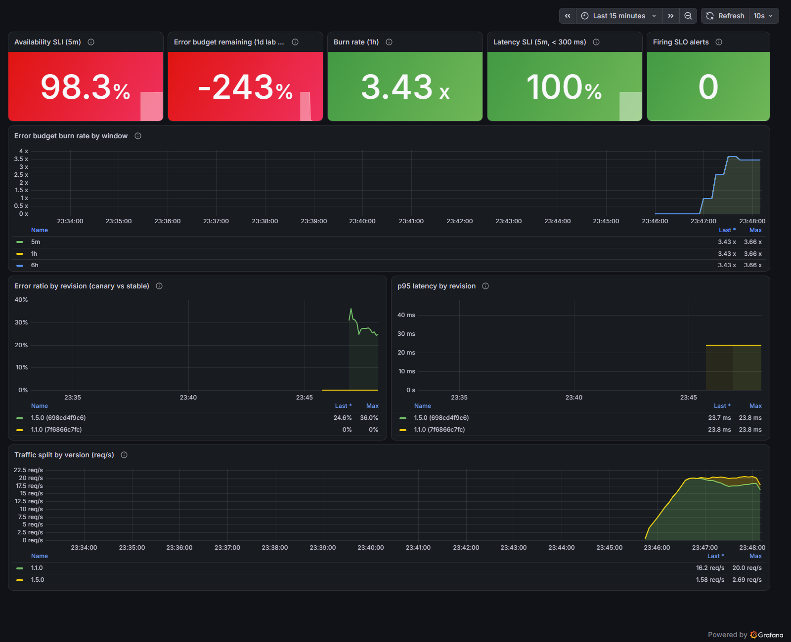

# Test results

**Recorded on:** 2026-10-02, on a fresh cluster with the final code (`make down && make up && make e2e && make chaos && make netpol`).

**Environment:** local **kind v0.33** cluster (1 control plane + 2 workers) on Docker Desktop, with Argo Rollouts v1.10.0, Prometheus v3.15.0, Grafana v13.2.3 and Helm 4.2. The end-to-end runs used `ci/fast-values.yaml`: analysis every 15 s, 30 s pauses. Thresholds are the same as the defaults.

**Not cloud-tested:** this project was not deployed to a managed cloud cluster. The runtime results below come from the local kind cluster.

**CI confirmation:** the same suite passed on GitHub-hosted runners: [CI run 37076324724](https://github.com/sufyanahmadkamboh/sufyan-devops-slo-progressive-delivery/actions/runs/37076324724).

| Stage | Result |
|---|---|
| Static stage (pytest, ruff, shellcheck, promtool, helm lint, kubeconform) | ✅ |
| Image stage (build and Trivy) | ✅ |
| End-to-end stage on a fresh kind cluster | ✅ |

**End-to-end stage in CI:**
- healthy 1.1.0 promoted
- 1.2.0 aborted on `canary-error-ratio`
- 1.3.0 aborted on `canary-p95-latency`
- Prometheus outage aborted the canary with phase `Error`
- the NetworkPolicy blocked another namespace

## Static validation

| Check | Tool | Result |
|---|---|---|
| Unit tests | pytest 9.1 | 11 passed |
| Lint and format | ruff 0.16 | clean |
| Shell scripts | shellcheck 0.11 | clean |
| Helm chart | helm lint | 0 failures |
| Kubernetes schemas (chart with default and fast values, platform) | kubeconform 0.8 (incl. Argo Rollouts CRD schemas) | 22 resources valid, 0 invalid |
| SLO rules syntax | promtool check rules | 13 rules, SUCCESS |
| SLO alert behaviour | promtool test rules | 4 test groups, SUCCESS |
| Image vulnerabilities | Trivy 0.75 (fixable HIGH/CRITICAL) | 0 findings, after removing pip/setuptools and applying OS updates (initially 5 HIGH) |

## End-to-end: release safety on kind

| # | Scenario | Release → decision | Measured canary SLIs | Outcome |
|---|---|---|---|---|
| 1 | Healthy release 1.1.0 | 23:37:42 → 23:40:28 (**2 min 46 s**, all steps) | error ratio 0 (9/9 checks), p95 23.75 ms (9/9 checks) | ✅ promoted to 100% |
| 2 | 1.2.0 with 25% injected errors | 23:40:58 → 23:41:45 (**47 s**) | error ratio **0.217**, **0.198** (limit 0.072) | ✅ aborted on `canary-error-ratio`; clients served only 1.1.0 |
| 3 | 1.3.0 with +600 ms latency | 23:42:47 → 23:43:33 (**46 s**) | p95 **0.975 s**, **0.975 s** (limit 0.3 s) | ✅ aborted on `canary-p95-latency`; clients served only 1.1.0 |

**How "clients served only 1.1.0" was checked:** after each abort, the test sends 40 requests to `/version` through the `orders-api` Service from inside the cluster, and asserts that the only version returned is the stable one.

**Why p95 shows 0.975 s:** `histogram_quantile` interpolates linearly inside the 0.5–1.0 s bucket. The real latency (about 600 ms + about 24 ms) is in that bucket, so the estimate is coarse but the breach is unambiguous.

## Failure test: Prometheus outage during a canary

| Step | Time |
|---|---|
| Healthy candidate 1.4.0 released | 23:44:09 |
| Prometheus scaled to 0 (canary at step 1) | 23:44:22 |
| Rollout aborted, AnalysisRun phase **Error** | 23:45:22 (**60 s** after the outage) |
| Both metrics: `consecutiveError=5` (limit 4) | |
| Prometheus restored, 1.1.0 healthy | 23:45:36 |

**Expected and observed:** a release that cannot be verified is not promoted, even if it is actually healthy. This is the intended fail-safe behaviour.

**Side effect found:** Prometheus uses an `emptyDir`, so the restart erased metric history and the SLO windows restart from zero. This is documented in [troubleshooting](troubleshooting.md).

## Security test: NetworkPolicy

| Probe | Result |
|---|---|
| Pod in `delivery` → `orders-api` | ✅ reachable |
| Pod in unrelated namespace `np-outsider` → `orders-api` | ✅ blocked (kindnet enforces NetworkPolicy) |

## Dashboard during an aborted release

Release 1.5.0 (25% errors) was aborted:
- the canary peaked at **36%** errors (1-minute rate) while stable 1.1.0 stayed at **0%**
- 1.5.0's traffic share dropped back to 0 after the abort

The "error budget remaining" stat is negative because Prometheus had only about 15 minutes of history after the chaos test, and that window contains several deliberately bad canaries. See [troubleshooting](troubleshooting.md).

## Issues found and fixed during testing

1. **Helm 4 server-side apply conflict** with controller-managed Service selectors, which failed the first end-to-end run. Fixed by removing the stable/canary Services and scoping the analysis to the pod-template-hash label.
2. **Image scan failures:** 5 fixable HIGH vulnerabilities in pip's vendored libraries, setuptools and libpcre2. Fixed in the Dockerfile.
3. **Dashboard gap:** a revision with zero errors had no error-ratio series, so stable disappeared from the panel. Fixed with an `or … * 0` fallback.
4. **`abortScaleDownDelaySeconds`** only applies with a traffic router, so it was removed to avoid misleading configuration.
